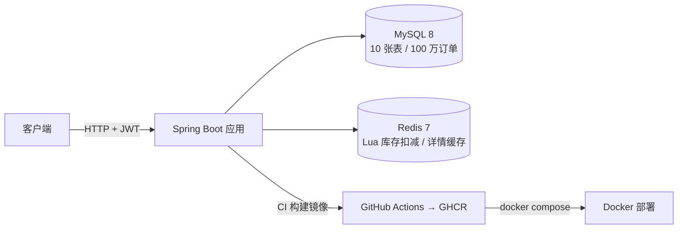
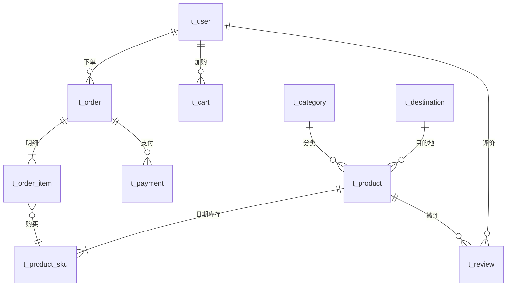

# 途游预订 - 旅游产品预订系统（跟团游/门票/酒店）

[](https://github.com/winter3642/tuyou-booking/actions)

> 主打：**数据库设计 + 慢 SQL 优化 + Redis 防超卖 + 工程化**。
> 技术栈：Spring Boot 3.5 · MyBatis-Plus 3.5.9 · MySQL 8 · Redis 7 · Redisson · JWT · JaCoCo

## 架构



- 鉴权：JWT（jjwt 0.12，HS384）+ 拦截器 + ThreadLocal（请求结束清理）
- 库存：Redis Lua 原子预扣 → DB 条件扣减兜底 → 失败回滚 Redis
- 缓存：Cache-Aside + 穿透（空值缓存）/ 击穿（Redisson 互斥锁）/ 雪崩（TTL 随机抖动）

## 功能列表

- **用户**：注册（BCrypt 加密）/ 登录（JWT 签发）/ 当前用户信息；管理端接口按角色鉴权
- **产品**：分类树、目的地列表、产品分页与详情（含 SKU 日期价格）、管理端 CRUD 与上下架
- **搜索**：关键词（全文索引）/ 分类 / 目的地 / 价格区间 / 排序（白名单防注入），分页
- **购物车**：幂等加购（同 user+sku 唯一）、改数量 / 删除（归属校验防越权）
- **订单**：购物车结算下单（雪花 ID 订单号）→ 订单列表 / 详情（防越权）；订单明细冗余快照；模拟支付流水
- **缓存**：产品详情 Cache-Aside + 三防；管理端修改自动失效缓存

## 数据库设计（10 张表）



**关键设计点**

| 设计 | 原因 |
|---|---|
| 订单主键雪花 ID（非自增） | 为分库分表铺路，时间有序 |
| 订单明细冗余 product_name/price 快照 | 防商品改名改价后历史订单失真 |
| t_order `idx_user_time(user_id, create_time)` | 用户查订单列表：等值 + 时间排序 |
| t_cart `uk(user_id, sku_id)` | 防重复加购 |
| t_product_sku 按日期拆行 | 节假日可调价，库存按日期粒度扣减 |

**数据量**：产品 10 万 / SKU 50 万 / 用户 50 万 / 订单 100 万 / 明细 200 万（`scripts/gen_data.py` 造数）。

## SQL 优化专题

慢查询定位：`SET GLOBAL slow_query_log=ON; long_query_time=0.1`，用 `EXPLAIN ANALYZE` 记录实际耗时（MySQL 8，数据 10 万+，缓冲池预热后测量）。

### 优化前后对比

> 测量方法：两条腿走路——① `EXPLAIN ANALYZE`（两边同口径，看执行计划 CPU 成本）② API 实测耗时（curl 计时，看真实收益）。数据 10 万行、缓冲池预热。

| 场景 | EXPLAIN ANALYZE 对比 | API 实测（优化前→后） | 手段 |
|---|---|---|---|
| 关键词搜索（低频词"产品99999"） | 扫 50005 行 → 读 1 行 | **~180ms → ~100ms** | FULLTEXT ngram 全文索引 |
| 关键词搜索（高频词"桂林"） | 扫 49631 行(估) → 读 9945 行 | ~110ms → ~105ms（持平） | 同上（见取舍说明） |
| 深分页 offset=90000（销量排序） | **91.5ms → 21.6ms**（消除 5 万次回表） | ~20ms → ~20ms（本规模持平，见说明） | 延迟关联：覆盖索引取主键 |
| 组合条件（分类+目的地+价格区间） | 反扫 49631 行逐行过滤 → 范围扫描 964 行 | 5.1ms → 3.4ms | `idx_cat_dest_price` 等值在前、范围在后 |
| 订单列表 | 6ms 稳定 | 6ms 稳定 | W1 建表时就埋了 `idx_user_time`，无需优化 |

### 案例 1：关键词搜索 LIKE → FULLTEXT

- **为什么 LIKE '%kw%' 慢**：前导通配符使索引失效，只能全表/全索引扫描。真正的杀手是**分页的 COUNT 查询**——COUNT 无法像 LIMIT 那样提前截断，无论命中多少行都要扫完整个反向索引（实测 88.7ms）；而 PAGE 查询在命中率高时提前截断反而快（0.5ms），命中率低时退化成全扫（157ms）。
- **为什么选 ngram FULLTEXT**：中文没有空格分词，ngram 按 2 字符切词（"桂林6日游"→桂林/林6/6日/日游），倒排索引直接命中，COUNT 与 PAGE 都只读匹配行的 posting 列表。
- **实现细节**：`MATCH(name) AGAINST(?) IN BOOLEAN MODE`；清洗用户输入中的布尔操作符（`+-<>()~*"@`）防语法错误/注入。
- **EXPLAIN 前后对比**：

| | type | key | rows | Extra |
|---|---|---|---|---|
| 前 LIKE | ref | idx_status_sales | 49631 | Using where |
| 后 FULLTEXT | fulltext | ft_name | 1 | Using where; Using filesort |

- **诚实的取舍**（面试加分项）：① FULLTEXT 有固定解析成本（实测每条查询 40~55ms），高频词场景（"桂林"命中 5000+）LIKE 靠 LIMIT 提前截断反而打平；FULLTEXT 的价值在于**最坏情况从 ~180ms 压到 ~100ms、性能不随命中率波动**。② ngram 最小分词 2 字符，单字关键词（"京"）搜不到，属已知限制，可讲"前缀搜索需另配 edge-ngram 或 ES"。

### 案例 2：深分页 延迟关联

- **问题**：`LIMIT 90000,20` 要跳过 9 万行，`SELECT *` 每跳一行都要回表取整行再丢弃。
- **方案**：两步走——① 只查主键 `SELECT id ... LIMIT 90000,20`，走 `idx_status_sales` 覆盖索引（Extra 出现 `Using index`，纯索引遍历零回表）；② `WHERE id IN (...)` 按主键取回 20 行整行，再按第①步顺序重排（IN 不保证顺序）。
- **EXPLAIN 关键变化**：内层查询从 `Index lookup`（每行回表）变成 `Covering index lookup`，CPU 成本 91.5ms → 21.6ms。
- **诚实说明**：本数据集 10 万行 + 缓冲池全热，回表发生在内存中，API 级耗时两方案都是 ~20ms；EXPLAIN ANALYZE 的差距是 CPU 成本差，**数据量到百万级或缓存冷时（回表变磁盘 IO）差距才会在 API 级放大**——这是面试能讲深的点："优化要分清 CPU 成本与 IO 成本，选方案前先测所处阶段"。
- **为什么不用游标分页**：`WHERE id > 上页最后id` 最快但无法跳页，产品列表要支持跳页，选延迟关联；接口层留了阈值（offset ≥ 10000 才走深分页路径），普通翻页不受影响。

### 案例 3：组合条件 等值在前、范围在后

- `WHERE category_id=? AND destination_id=? AND price BETWEEN ? AND ? ORDER BY sales DESC`
- 建 `idx_cat_dest_price(category_id, destination_id, price)`：等值列在前、范围列在后，排序列跟上；EXPLAIN 显示 Index range scan（964 行），无索引时依赖 `idx_status_sales` 反扫 49631 行逐行过滤（且随数据分布劣化）。

### 案例 4：订单列表 —— 设计阶段埋索引

`WHERE user_id=? ORDER BY create_time DESC` 走 W1 建表时的 `idx_user_time(user_id, create_time)`：EXPLAIN `type=ref`、反向扫描、6ms 稳定。说明**索引设计应前置到建模阶段**，而不是慢查询出现后再救火。

## Redis 防超卖与缓存三防

- **Lua 原子扣减**：`stock:sku:{id}` 预扣，脚本内完成"读取→判断→扣减"，Redis 单线程执行期间无命令插入；下单链路 Redis 预扣 → DB 条件扣减（`WHERE stock>=?`）兜底 → 失败回滚 Redis。
- **缓存三防**：穿透（空值缓存 60s）/ 击穿（Redisson 互斥锁 + 双重检查）/ 雪崩（TTL 600s + 0~300s 随机抖动）。
- 并发验证：200 线程抢 100 库存，成功订单恰好 100、库存终值 0、无负库存（JUnit 并发测试）。

## 测试

- 分层：Mockito 单测（Service/工具/拦截器/异常处理器）+ MockMvc 接口测试（注册登录/搜索/购物车/下单全链路、越权 403、参数校验 400）
- 数据隔离：独立测试库 `tuyou_test` + `@Sql` 每方法前初始化/后清理（`@SqlConfig(encoding="UTF-8")` 显式声明脚本编码）
- 运行：`mvn test jacoco:report`，报告在 `target/site/jacoco/index.html`
- 测试数量：**104 个，全绿**；覆盖率：**95.9%**（470/490 行，不含 entity/dto/vo 纯数据类）

## 压测

详见 [docs/压测报告.md](docs/压测报告.md)（JMeter 5.6.3，计划文件 `scripts/bench/*.jmx` 可复现）。

**核心结果：**
- **超卖验证**：1000 并发抢 100 库存 → 成功下单恰好 **100**、DB/Redis 库存终值 **0**、无负库存、**超卖率 0** ✅
- **下单接口**：200 并发 × 50 轮全链路（加购→查车→下单）30000 请求 0 传输错误；本机 Docker 部署形态 ~155 req/s，瓶颈经四轮排除（连接池/线程池/缓冲池/形态对比）定位为 **Docker Desktop Windows 端口转发**，非应用本身
- 调优迭代与踩坑记录全部入报告（业务失败也返回 HTTP 200、订单时间戳为 DB UTC 默认值等）

## 技术选型理由

| 选型 | 一句话理由 |
|---|---|
| Spring Boot 3.5 / Java 17 | 当前主流版本，自动装配省样板；record/VO 分层清晰 |
| MyBatis-Plus | 单表 CRUD 免写 SQL 提效；多条件搜索手写 MyBatis SQL 保证可控性 |
| MySQL 8 | 关系业务 + InnoDB 事务；ngram 全文索引原生支持中文关键词搜索 |
| Redis 7 | 单线程 + Lua 脚本保证库存扣减原子性；缓存三防的载体 |
| Redisson | 成熟的分布式锁实现（可重入、自动续期），防缓存击穿 |
| JWT（jjwt 0.12） | 无状态鉴权，前后端分离标配；HS384 签名 |
| Docker + GitHub Actions | 多阶段构建镜像、CI 服务容器跑测试、Compose 一键部署 |

## 快速开始

```bash
# 1. 初始化数据库（建库 + 10 张表 + 应用账号，root 执行一次）
mysql -uroot -p < sql/init.sql
# 2. 造测试数据（可选；pip install pymysql 后执行，约 2 分钟）
python scripts/gen_data.py
# 3. 起 Redis（密码与 application.yml 一致）
docker run -d --name tuyou-redis -p 6379:6379 redis:7 --requirepass tuyou123
# 4. 起应用（默认 8080）
mvn spring-boot:run
```

> 更省事的方式：`docker compose up -d` 一条命令拉起 MySQL + Redis + 应用三容器（本机映射 8082 端口，见 docker-compose.yml）。
